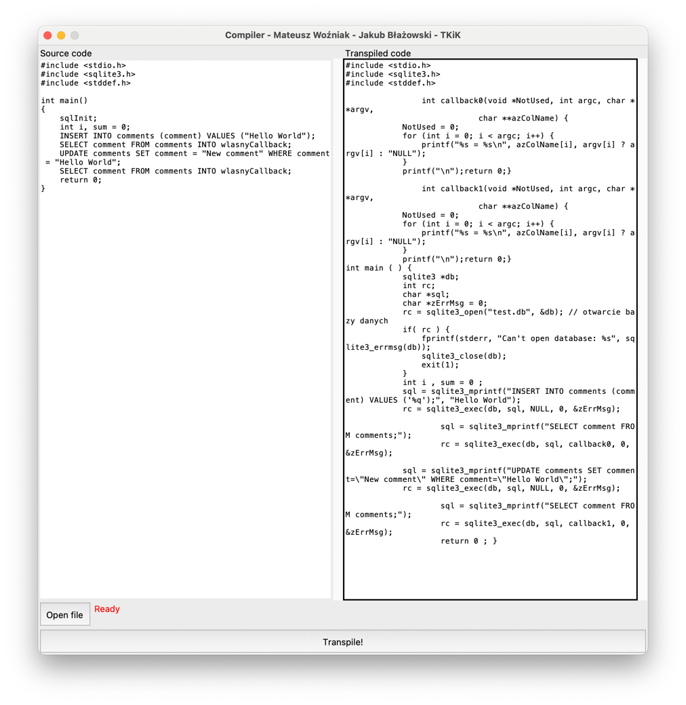

# Kompilator - projekt TKiK - ISI 2023

> Niniejszy projekt to transpilator nakładki na C dodającą obsługę SQL'a.

## Autorzy:
- Mateusz Woźniak
- Jakub Błażowski

## Przykładowy kod:

```c
#include <stdio.h>
#include <sqlite3.h>
#include <stddef.h>

int main()
{
    sqlInit;
    int i, sum = 0;
    INSERT INTO comments (comment) VALUES ("Hello World");
    SELECT comment FROM comments INTO ownCallback;
    UPDATE comments SET comment = "New comment" WHERE comment = "Hello World";
    return 0;
}
```

## Jak uruchomić?
```bash
pip install -r requirements.txt
python window.py # Uruchamia okno kompilatora

# Proszę ztranspilowany kod zapisać do pliku output.c
gcc output.c -o demo -l sqlite3
./demo
```



## Przykłady
1. Niedziałający kod (`Syntax error at line 8:4 - no viable alternative at input 'sqlInitreturn'`)
```c
#include <stdio.h>
#include <sqlite3.h>
#include <stddef.h>

int main()
{
    sqlInit 
    return 0;
}

```

2. Niedziałający kod (`Syntax error at line 9:4 - mismatched input 'return' expecting ' FROM '`)

```c
#include <stdio.h>
#include <sqlite3.h>
#include <stddef.h>

int main()
{
    sqlInit;
    SELECT a,b 
    return 0;
}
```

3. Niedziałający kod (`Syntax error at line 0:0 - There is no sqlInit;`)

```c
#include <stdio.h>
#include <sqlite3.h>
#include <stddef.h>

int main()
{
    SELECT a,b 
    return 0;
}
```

4. Działający kod
```c
#include <stdio.h>
#include <sqlite3.h>
#include <stddef.h>

int main()
{
    sqlInit;
    int i, sum = 0;
    INSERT INTO comments (comment) VALUES ("Hello World");
    SELECT comment FROM comments INTO ownCallback;
    UPDATE comments SET comment = "New comment" WHERE comment = "Hello World";
    return 0;
}
```